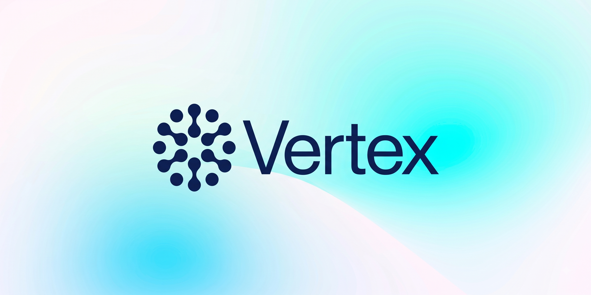

<p align="center">
  
</p>

<p align="center">
  
  
  
  
</p>

**Vertex is a safe, fast, and expressive general-purpose programming language.**
Statically typed, compiled, multi-platform, with native accelerated compute:
`kernel` and `graph` are function qualifiers, not a separate toolchain.

**vsc** is its compiler — a front end for the Vertex language and a native
backend, written in Go, with no dependency on a host `cc`, `as`, or `ld`. It
reads `.vs` source and writes a linked executable, an object file, or VIR, the
typed IR shared across the Vertex toolchain. Code generation, object encoding,
and linking are all in the box, so cross-compiling needs no external toolchain
installed.

It is a command and a library, running the same code: `vsc build` and
`vsc.Build("app", "main.vs")` reach the same compiler, because the command is a
wrapper over the package at the root of this repository and has nothing of its
own.

Swift is the core dialect: the language `vsc` reads is Swift, and what Vertex
adds sits on top of it and is optional — see [Swift, and what Vertex adds
to it](#swift-and-what-vertex-adds-to-it).

---

- [Install](#install)
- [Quick start](#quick-start)
- [Language](#language)
- [Kernels and graphs](#kernels-and-graphs)
- [Swift, and what Vertex adds to it](#swift-and-what-vertex-adds-to-it)
- [Targets](#targets)
- [CLI](#cli)
- [Go API](#go-api)
- [Architecture](#architecture)

---

## Install

```console
$ GOPROXY=direct go install github.com/vertex-language/vsc/cmd/vsc@latest
```

Requires Go 1.23 or newer. Nothing else.

---

## Quick start

```swift
// fib.vs
package main

func fib(n: int32) -> int32 {
    if n <= 1 { return n }
    return fib(n - 1) + fib(n - 2)
}

func main() -> int32 {
    print("fib(10) = \(fib(10))")
    return 0
}
```

```console
$ vsc build -o fib fib.vs
$ ./fib
fib(10) = 55

$ vsc run fib.vs
fib(10) = 55

$ vsc check fib.vs && echo ok
ok
```

The same thing from Go, at the import path you would guess:

```go
import "github.com/vertex-language/vsc"

err := vsc.Build("fib", "fib.vs")   // compile and link
out, err := vsc.Run("fib.vs")       // …or just run it: out is "fib(10) = 55\n"
```

`main` in package `main` is the entry point. `vsc build --emit vir` stops after
lowering and prints the module — typed, in SSA form, with explicit control
flow, the same shape the backends select instructions from:

```console
$ vsc build --emit vir -o - fib.vs
```

```vertex-ir
export func @main.fib(%n i32) i32 nounwind {
@entry:
  %0 = i32.const 1
  %1 = i32.sle %n, %0
  brif %1, @then, @else

@then:
  return %n

@else:
  %2 = i32.const 1
  %3 = i32.sub %n, %2
  %4 = call @main.fib(%3)
  %5 = i32.const 2
  %6 = i32.sub %n, %5
  %7 = call @main.fib(%6)
  %8 = i32.add %4, %7
  return %8
}
```

---

## Language

Vertex compiles ahead of time to a native binary. No interpreter, no VM,
nothing to install next to the program you built.

**Types and memory.** `struct` and `enum` are value types with inline layout
and no header. `class` is a reference type, heap-allocated and reference
counted — ARC, with `weak` and `unowned` — and retain and release are emitted
inline rather than called into a runtime library, so code that declares no
classes links no refcounting at all. `protocol` is a compile-time constraint;
generics are resolved by monomorphization, so a generic call is a direct call
and witness tables appear only where you ask for an existential.

**Ownership.** `borrowing` and `consuming` parameter modifiers, `~Copyable`
types, `consume` and `borrow` expressions, and lifetime checking in the
analyzer rather than as a later pass. Value types move by default where a copy
is not observed.

**Naming.** Type names are lowercase — `int32`, `string`, `vec2`, `parser` —
and that is the style for new code. Capitalized names are accepted and mean the
same thing.

**Argument labels are opt-in.** A parameter is positional unless given a label,
so `func fib(n: int32)` is called as `fib(10)`. Write a label in front of the
name when the call site reads better for it — `func move(to dest: point)`,
called as `move(to: p)`.

**Packages.** Every file opens with a `package` declaration, and the package is
the unit of compilation, naming, and visibility. Imports name packages, not
files.

**Receivers.** Methods may be declared outside the type they belong to, on
`struct`, `enum` and `class` alike:

```swift
package geom

struct vec2 {
    var x: float32
    var y: float32
}

func (v borrowing vec2) length() -> float32 {
    return (v.x * v.x + v.y * v.y).squareRoot()
}

func (v inout vec2) scale(k: float32) {
    v.x *= k
    v.y *= k
}
```

The receiver takes the same ownership modifiers a parameter does, which is the
reason the form exists: `borrowing`, `consuming` and `inout` are visible in the
signature instead of implied by a keyword on the body. Members declared inside
the type body produce the same symbol.

**Direct control where you want it.** Explicit pointer types — `rawpointer`,
`pointer<T>`, `buffer<T>` — with alignment and volatility in the type. `unsafe`
blocks for pointer arithmetic and type punning. Layout attributes, `@packed`
and `@align(n)`. C interop by declaration with `@extern(c)`, using the C ABI of
the selected target. None of it is needed to write ordinary code.

**No mandatory runtime.** No garbage collector, no reflection metadata, no
dynamic casting, no unwinding tables, and no standard library you cannot
compile without. Heap allocation is a call you wrote or a class you
instantiated, and nothing else.

Diagnostics do not depend on what the compiler does afterwards. Analysis runs
before the IR exists, so `vsc check` and `vsc build` report the same set, and a
rejection cites the section of the spec it violates.

The test suite is a corpus of self-checking `.vs` programs, each compiled,
linked, and run against an expected exit status and output — see
[`tests/`](tests/).

---

## Kernels and graphs

Accelerated code is written in Vertex, in the same file, checked by the same
front end. `kernel` and `graph` sit where an effect goes — after the parameter
list, before the return arrow — because that is what they are: a statement
about where and how the function runs.

### `kernel` — data-parallel, one thread per element

```swift
package compute

func add(x: buffer<float32>, y: buffer<float32>) kernel -> float32 {
    let i = thread.x
    return x[i] + y[i]
}
```

A kernel body is written from the point of view of one thread and returns the
element that thread produced. The launch shape and the output buffer come from
the call site, so the common case needs no bounds guard and no output
parameter:

```swift
let z = add(x, y).launch(over: x.count)   // z: buffer<float32>
```

Everything a hand-written device kernel needs is still reachable. `thread.x`,
`thread.y`, `thread.z` and `group` give position; `@shared` declares
group-local storage; `barrier()` synchronizes a group; `launch(grid:group:)`
takes the shape explicitly when the default tiling is wrong. A kernel that
returns nothing writes through an `inout buffer` instead — the form to reach
for when the output shape is not the input shape.

### `graph` — whole-array, traced rather than executed

```swift
func attention(q: tensor<float32>, k: tensor<float32>, v: tensor<float32>) graph -> tensor<float32> {
    let scores = matmul(q, k.transposed()) / sqrt(float32(q.shape[-1]))
    return matmul(softmax(scores, axis: -1), v)
}
```

A `graph` function does not run when you call it. It is traced at compile time
into a dataflow module, shape- and dtype-checked against its signature, and
lowered as a whole — so fusion, layout, and scheduling are decided with the
entire function in view, which a kernel-at-a-time model structurally cannot do.
Vertex emits StableHLO for it, making TPUs and other accelerators with a
StableHLO ingest path targets rather than ports.

### Both are ordinary functions

Same types, same generics, same ownership rules, same diagnostics. A buffer
handed to a kernel is borrowed for the duration of the launch and the analyzer
knows it, so use-after-free across a launch boundary is a compile error rather
than a debugging session. Device code that fails to typecheck fails
`vsc check`, at the line you wrote, before any device toolchain is involved —
because there isn't one.

Device lowering is Vertex's own, shared with `v++`. No nvcc, no NVRTC, no LLVM,
no XLA. `vsc` emits device code the way it emits AMD64: through VIR, to an
encoder in the toolchain. `--emit vir` shows host and device modules together,
in the same textual form.

---

## Swift, and what Vertex adds to it

Swift is the core dialect. The language `vsc` reads is Swift — its syntax, and
the ownership model behind it: value and reference types, ARC, borrowing and
consuming — and being on par with Swift's own compiler is the standard the
front end is held to, not an approximation of it. Where the published grammar
and `swiftc` disagree, `swiftc` is right, and the tests say so:
`parser/oracle_test.go` parses every module interface in every installed SDK
and compares verdicts with `swiftc` over a corpus of malformed sources, and
[`parser/README.md`](parser/README.md) catalogues every place the language
turned out to be wider than the published grammar, and
[`analyzer/README.md`](analyzer/README.md) says what the checker knows and
what it deliberately stays quiet about.
[`proposed_layout.md`](proposed_layout.md) and
[`proposed_vil.md`](proposed_vil.md) are the plan for what comes after them.

What Vertex adds sits on top of that, and every piece of it is optional.
Package declarations, receivers, opt-in argument labels, `kernel` and `graph`,
and the lowercase type names are Vertex spellings: a program that uses none of
them is a Swift program, and a program that uses them is Swift and something
else. The type names are the clearest case of the rule. `Int`, `Int32`,
`String` and `Double` are the language's names and always will be; `int`,
`int32`, `string` and `float64` are aliases Vertex offers beside them, never in
place of them, and a Swift program that never writes one is unaffected by their
existence.

What is not here is the rest of a Swift toolchain: no Swift standard library,
no Foundation, no Objective-C interop, no `.swiftmodule` to import. The `.vs`
extension is enforced for that reason — `vsc` will not compile a `.swift` file,
so a Swift source tree is never silently built against a library it was not
written for.

---

## Targets

`vsc` composes the same object encoders and linkers `vcc` does, so every target
is available from any host with no cross-toolchain installed. `vsc env` prints
the target resolved for the current machine.

**Host**

| Target | Container | |
|---|---|---|
| `aarch64-macos`, `x86_64-macos` | Mach-O | |
| `aarch64-linux`, `x86_64-linux` | ELF | |
| `wasm32-vertex-none` | Wasm | freestanding: linear memory, no host runtime |
| `x86_64-elf`, `aarch64-elf` | ELF | freestanding: no OS, no libc |
| `x86_64-windows` | PE / COFF | modelled, not yet buildable |

**Device**

| Target | Emits | |
|---|---|---|
| `nvptx64-vertex` | PTX | `kernel` functions |
| `amdgcn-vertex` | GCN | `kernel` functions; modelled, not yet buildable |
| `stablehlo-vertex` | StableHLO | `graph` functions |

Select a host target with `-target` and a device target with `-device`:

```console
$ vsc build -target x86_64-linux -device nvptx64-vertex -o app main.vs
```

A target name decides two things at once — the type model the front end sizes
against, and the architecture, container and symbol prefix below the IR — and
both halves live in one table, so a name means one thing. `x86_64-windows` and
`amdgcn-vertex` are in it with the second half complete and no backend behind
them, which `vsc` says rather than hides.

---

## CLI

Verb first, like `go` and `git` — `vsc build main.vs`, not `vsc main.vs`. Each
verb runs the same pipeline phases the compiler runs, so an inspection command
can never show something `vsc build` would reject.

| Command | |
|---|---|
| `vsc build` | compile and link; with `--emit`, stop earlier |
| `vsc run` | compile, link to a temp path, execute, forward the exit code |
| `vsc check` | parse and typecheck; no artifact |
| `vsc ast` | parse and dump the syntax tree |
| `vsc tokens` | dump the token stream |
| `vsc env` | print the resolved target, package list, and library list |

`--emit` replaces the mode flags with one option:

| | | like |
|---|---|---|
| `--emit exe` | compile and link (default) | |
| `--emit obj` | one object file per input | `cc -c` |
| `--emit vir` | the lowered IR module, host and device | |
| `--emit asm` | target assembly | `cc -S` |
| `--emit device` | device code alone: PTX, GCN, or StableHLO | |

Standard flags carry over where a standard exists: `-o`, `-L`, `-l`,
`-static`, `-freestanding`, `-target`. `-I` adds a package search path,
`-device` selects a device target. `-` means stdin or stdout anywhere a path is
accepted.

Inputs `vsc` does not compile — a `.o`, a `.a` — are passed to the linker in
place, in command-line order, because a static link is order-sensitive and
reordering it would be `vsc` deciding something you said.

---

## Go API

`vsc` is a library, and the root of this repository is the package:

```go
import "github.com/vertex-language/vsc"

err := vsc.Build("hello", "hello.vs")   // compile and link, for this host
out, err := vsc.Run("hello.vs")         // build to a temp path, run it, take stdout
```

Past those two shorthands everything is a `Compiler` and a parameter struct.
The zero `Compiler` builds for this host; a target, a device, a package path,
or libraries are fields:

```go
c := &vsc.Compiler{
	Target:      "x86_64-linux",
	Device:      "nvptx64-vertex",
	PackageDirs: []string{"packages"},
}

err := c.Build(vsc.BuildParams{
	Output:  "app",
	Inputs:  []vsc.Input{vsc.File("main.vs"), vsc.File("compute.vs"), vsc.File("libfoo.a")},
	Libs:    []string{"m"},
	LibDirs: []string{"vendor/lib"},
})
```

Every phase is reachable on its own, each rung the one below it plus one step —
`Source`, `Parse`, `Check`, `IR`, `Object`, `Build`. Diagnostics come back as
values, sited in the file you wrote:

```go
diags, err := c.Check(vsc.File("main.vs"))   // err means vsc could not run
for _, d := range diags {                    // d.Severity, d.Site, d.Message
	fmt.Println(d)
}
```

Source does not have to be a file. `vsc.Text(name, data)` compiles bytes the
caller already has, an object comes back as bytes, and the linkers take bytes,
so a build can run start to finish without touching the filesystem:

```go
obj, diags, err := c.Object(vsc.Text("gen.vs", src))
prog, err := c.Program(vsc.BuildParams{Inputs: []vsc.Input{vsc.ObjectBytes("gen.o", obj)}})
defer prog.Close()

cmd := prog.Command("--flag")   // an unstarted *exec.Cmd: running is os/exec's job
cmd.Stdout = &buf
err = cmd.Run()
```

For tooling that wants only the front end, the sub-packages cost nothing else:

```go
import (
	"github.com/vertex-language/vsc/ast"
	"github.com/vertex-language/vsc/parser"
	"github.com/vertex-language/vsc/token"
)

unit := token.NewFile("a.vs", src)
file, diags := parser.ParseFile(unit, parser.DefaultMode)
defer file.Release()

ast.Inspect(file, func(n ast.Node) bool {
	return true
})
```

`ParseFile` runs the scanner itself and always returns a non-nil tree — a
partial parse yields `Bad*` placeholder nodes rather than nothing. See
[`parser/`](parser/) and [`ast/`](ast/).

---

## Architecture

Each stage is its own package with minimal cross-dependencies:

```
scanner → parser → analyzer → lower → vsc
 .vs tokens   AST    types,      typed    isel, encode,
                     generics,   AST→VIR   link
                     ownership,
                     lifetimes,
                     shapes
```

Ownership is checked in `analyzer` against the typed AST, and retain, release
and destroy are inserted in `lower` on the way to VIR — so the IR a backend
sees has no implicit lifetime operations left in it, and `--emit vir` shows
every one of them. `kernel` and `graph` bodies go through the same phases, and
`lower` splits the module in two, host and device, before either reaches a
backend.

The root package is the composition: it runs the phases in order, holds the
target tables, and carries a module through instruction selection, object
writing and linking. `cli` is a wrapper over it, and so is any other program
that wants a Vertex compiler.

What is in this repository today is the front end: everything from source
text to a checked tree. It is held to Swift by two oracles — every module
interface in every installed SDK must parse, and `swiftc` must agree with it
about which programs are Swift and which are not. The phases below `lower` are
described here as the design they are being built to; the table says which of
them exist.

| Package | | |
|---|---|---|
| [`token/`](token/) | lexical vocabulary, source positions, file model | |
| [`scanner/`](scanner/) | tokenization, literal decoding | |
| [`parser/`](parser/) · [`ast/`](ast/) | tokens to AST; the syntax tree | |
| [`analyzer/`](analyzer/) · [`types/`](types/) | name resolution, types, layout, ownership | |
| [`vil/`](vil/) | the ownership IR: a clone of Swift's SIL, its text form, its rules, and the lowering into it | started |
| `lower/` | canonical VIL to VIR; host/device split | planned |
| `.` | the phases composed, the target tables, isel, object writing, linking | planned |
| `core/` | the built-in package | planned |
| `cli/` · `cmd/vsc/` | verb dispatch and the executable | planned |

Everything downstream of `lower` — instruction selection and encoding for
AMD64, ARM64, and Wasm, the PTX and StableHLO device emitters, and the ELF,
Mach-O, and PE writers and linkers — lives in independent `vertex-language`
repositories shared with `vcc` and `v++`. The files that compose them
(`target.go`, `codegen.go`, `device.go`, `link.go`) import those repositories
and nothing of the `vsc` front end, so the compilers in the family meet at VIR
and nowhere else.

---

## License

MIT. See [LICENSE](LICENSE).